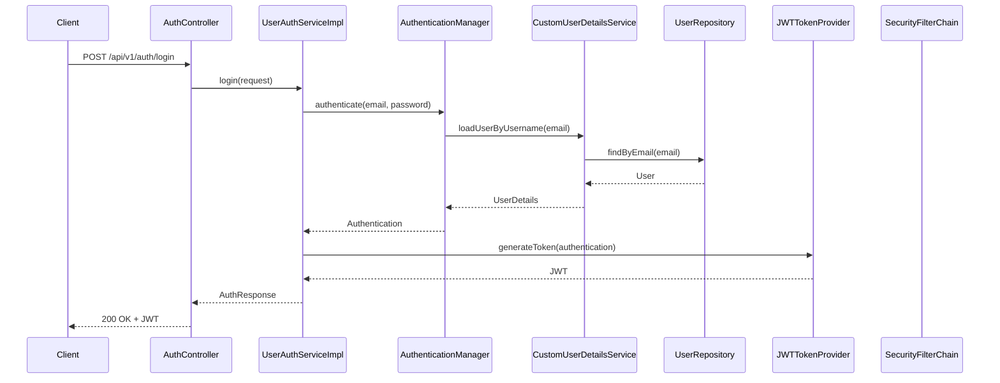
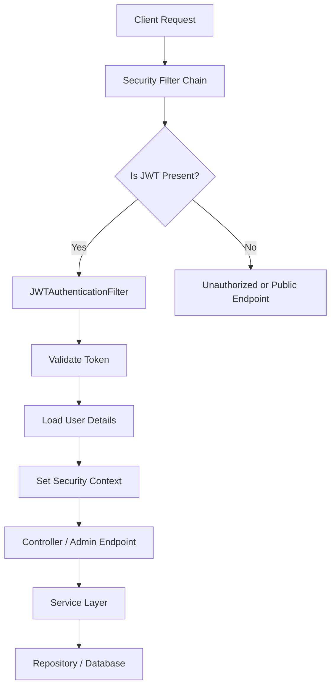

# User Auth Service - Architecture, Flow, and Production Use Cases

## 1. Service Purpose

This project is a Spring Boot-based authentication and authorization service. Its responsibility is to:

- register new users,
- authenticate users,
- issue JWT tokens,
- protect APIs with Spring Security,
- support role-based access control,
- expose admin endpoints for user management.

In simple terms, this service acts as the identity layer for the application ecosystem.

---

## 2. Technology Stack

- Java 21
- Spring Boot 4.0.6
- Spring Web MVC
- Spring Security
- Spring Data JPA
- PostgreSQL/MySQL support
- JWT using JJWT
- MapStruct for DTO-to-entity mapping
- Lombok for boilerplate reduction
- OpenAPI / Swagger for API documentation
- Eureka Client for service discovery
- Actuator for health/monitoring endpoints

---

## 3. Package-by-Package Analysis

### 1) com.awp

File: UserAuthServiceApplication.java

- This is the main Spring Boot entry point.
- It bootstraps the application and loads environment variables from a .env file if present.
- This is the starting point for the entire service.

### 2) com.awp.userAuth.config

Files:

- SecurityConfig.java

Responsibilities:

- Configures Spring Security.
- Enables stateless authentication.
- Allows public access only to auth and Swagger endpoints.
- Protects all other routes.
- Enables CORS for frontend clients.
- Registers JWT filter before username/password auth filter.

Key concepts implemented:

- Security filter chain
- Stateless session policy
- AuthenticationManager bean
- Password encoder bean using BCrypt
- Role-based access control
- CORS configuration

### 3) com.awp.userAuth.controller

Files:

- AuthController.java
- AdminController.java

Responsibilities:

- Exposes REST endpoints for authentication and admin operations.
- Accepts incoming HTTP requests and delegates business logic to the service layer.

Important endpoints:

- AuthController: login, register, logout
- AdminController: list users, make admin

### 4) com.awp.userAuth.dto

Files:

- LoginRequest.java
- RegisterRequest.java
- AuthResponse.java
- UserSummary.java

Responsibilities:

- Defines request/response DTOs.
- Keeps controller input and output clean and structured.
- Supports validation annotations for request payload integrity.

Why it matters:

- DTOs prevent leaking internal entity details directly over the API.
- They create a clear contract between clients and the service.

### 5) com.awp.userAuth.entity

Files:

- User.java
- Role.java
- UserPrincipal.java

Responsibilities:

- Defines the persistence model and security principal.

Key concepts:

- User entity mapped to the database.
- Role enum with USER and ADMIN values.
- UserPrincipal adapts the database user into Spring Security's UserDetails contract.

This layer bridges the application database model and the Spring Security framework.

### 6) com.awp.userAuth.service

Files:

- UserAuthService.java
- UserAuthServiceImpl.java
- CustomUserDetailsService.java

Responsibilities:

- Implements the core business logic for authentication and user management.
- Coordinates the repository, password encoding, JWT generation, and security context.

Key concepts:

- Service layer abstraction
- Authentication flow orchestration
- Transaction management
- Password hashing
- Role assignment

### 7) com.awp.userAuth.repository

File:

- UserRepository.java

Responsibilities:

- Data access layer for users.
- Uses Spring Data JPA to perform CRUD and custom queries.

Key methods:

- existsByEmail
- findByEmail

### 8) com.awp.userAuth.jwt

Files:

- JWTAuthenticationFilter.java
- JWTTokenProvider.java
- JWTAuthEntryPoint.java

Responsibilities:

- Implements JWT-based authentication.

Key concepts:

- JWT filter intercepts incoming requests.
- JWT provider creates and validates tokens.
- Authentication entry point handles unauthorized access.

### 9) com.awp.userAuth.mapper

File:

- UserMapper.java

Responsibilities:

- Maps DTOs to entities and entities to response objects.
- Uses MapStruct to reduce manual mapping code.

### 10) com.awp.userAuth.exception

Files:

- GlobalExceptionHandler.java
- responseBuilder/ExceptionResponseBuilder.java
- responseBuilder/ErrorDetails.java
- userDomain/\*.java

Responsibilities:

- Centralizes error handling.
- Converts exceptions into structured API responses.

Key concepts:

- Centralized exception handling
- Consistent error schema
- Validation error response handling
- Domain-specific exceptions for authentication and user conflicts

### 11) com.awp.userAuth.util

File:

- PasswordGenerator.java

Responsibilities:

- A simple utility to generate BCrypt-hashed passwords for testing or setup purposes.

---

## 4. Core Concepts Implemented

### A. Spring Boot REST API

The service exposes REST endpoints using Spring MVC controllers.

### B. Spring Security

The application uses Spring Security to protect endpoints and authenticate users.

### C. JWT Authentication

Instead of relying on server-side sessions, the service uses JWTs for stateless authentication.

### D. Role-Based Access Control (RBAC)

Users have roles such as USER and ADMIN. Protected admin endpoints require the ADMIN role.

### E. Password Encoding

Passwords are hashed using BCrypt before being saved to the database.

### F. Validation

Incoming requests are validated using Bean Validation annotations such as @Email, @NotBlank, and @Size.

### G. Exception Handling

Global exception handling ensures consistent API behavior for validation failures, bad credentials, and domain errors.

### H. Data Persistence with JPA

The application uses Spring Data JPA to persist user records in a relational database.

### I. Swagger / OpenAPI

The service exposes API documentation for easier testing and integration.

### J. Service Discovery Integration

The application is configured as an Eureka client, enabling microservice registration.

---

## 5. Full Project Flow

### A. User Registration Flow

1. Client sends a POST request to /api/v1/auth/register.
2. AuthController receives the request.
3. UserAuthServiceImpl validates the email and checks if it already exists.
4. If the email is new, the user is created with a default USER role.
5. The password is encoded with BCrypt.
6. The user is saved in the database.
7. The service returns a success response with a user summary.

### B. User Login Flow

1. Client sends a POST request to /api/v1/auth/login.
2. AuthController forwards the request to UserAuthServiceImpl.
3. AuthenticationManager authenticates the user using the email and password.
4. CustomUserDetailsService loads the user from the database.
5. If credentials are valid, Spring Security creates an authenticated principal.
6. JWTTokenProvider generates a JWT token with user information and role claims.
7. The token is returned to the client in the response body.

### C. Accessing a Protected API

1. Client sends a request to a protected route with Authorization: Bearer <token>.
2. JWTAuthenticationFilter intercepts the request.
3. The filter extracts the token from the header.
4. The token is validated.
5. The username is extracted from the JWT payload.
6. Spring Security loads the user details from the database.
7. The user is placed into the SecurityContext.
8. The controller executes based on the role and authorization rules.

### D. Admin Flow

1. An authenticated admin sends a request to /api/v1/admin.
2. Spring Security checks the role via @PreAuthorize("hasRole('ADMIN')").
3. If authorized, the admin endpoint executes and returns user data.

---

## 6. Mermaid Flow Diagram

---

## 7. API Endpoints Summary

### Public Endpoints

| Method | Endpoint              | Purpose                       |
| ------ | --------------------- | ----------------------------- |
| POST   | /api/v1/auth/login    | Authenticate user and get JWT |
| POST   | /api/v1/auth/sign-in  | Alias for login               |
| POST   | /api/v1/auth/register | Register new user             |
| POST   | /api/v1/auth/sign-up  | Alias for register            |
| POST   | /api/v1/auth/logout   | Clear security context        |

### Protected Endpoints

| Method | Endpoint                 | Access     |
| ------ | ------------------------ | ---------- |
| GET    | /api/v1/admin            | ADMIN only |
| PATCH  | /api/v1/admin/make-admin | ADMIN only |

### Documentation Endpoints

| Method | Endpoint               | Purpose          |
| ------ | ---------------------- | ---------------- |
| GET    | /swagger-ui/index.html | Swagger UI       |
| GET    | /v3/api-docs           | OpenAPI document |

---

## 8. Why This Architecture Is Good for Production

### 1) Secure authentication model

The service uses Spring Security and BCrypt hashing, which are widely adopted best practices for protecting user credentials.

### 2) Stateless JWT makes scaling easier

Because authentication is stateless, the service does not need to keep session data in memory. This is ideal for horizontal scaling and distributed deployments.

### 3) Role-based access control is production-friendly

This design supports multiple user types such as USER, ADMIN, or future roles like MANAGER, SUPPORT, or AUDITOR.

### 4) Clear separation of concerns

The code follows a clean layered architecture:

- Controller for HTTP handling
- Service for business logic
- Repository for data access
- Security components for authentication

This makes the system easy to maintain and extend.

### 5) Suitable for microservice ecosystems

This service fits very well in a microservice architecture where other services can rely on this auth service for identity and token validation.

### 6) Works well with modern frontend apps

The CORS configuration supports a frontend client such as React or Angular, making it easy to integrate with modern web applications.

### 7) Easy to extend for enterprise use cases

The current implementation is a strong base for:

- SaaS platforms,
- enterprise portals,
- B2B applications,
- internal admin systems,
- mobile application backends.

---

## 9. Production-Level Use Cases

### Use Case 1: User Authentication for a Web or Mobile App

A frontend or mobile app needs to let customers register and log in securely.
Why this design fits:

- It provides secure login and registration.
- JWT allows sessions without server-side session storage.
- It integrates naturally with APIs and mobile clients.

### Use Case 2: Central Authentication Service for Microservices

Multiple internal services need a common identity mechanism.
Why this design fits:

- The auth service can issue tokens that other services validate.
- It avoids duplicating login logic across services.
- It supports service-to-service trust patterns in a scalable architecture.

### Use Case 3: Admin Portal Access Control

An admin panel needs to restrict sensitive operations to authorized personnel only.
Why this design fits:

- The existing role-based authorization model can be extended for admin-only operations.
- The service already supports role checks and protected endpoints.

### Use Case 4: Enterprise SaaS Platform

An organization wants secure user access to dashboards, reports, and account settings.
Why this design fits:

- It is a strong foundation for secure multi-user systems.
- The architecture can evolve into a full identity platform with refresh tokens, OAuth2, password reset, and MFA.

### Use Case 5: API Gateway Protected Resource Access

A gateway routes requests to multiple downstream services, while this auth service authenticates clients.
Why this design fits:

- JWT-based auth is standard and interoperable.
- The service can be used as the identity gateway for protected resources.

---

## 10. Production Hardening Recommendations

Although the service is well-structured, production-grade systems should add the following improvements:

- Refresh token support
- Token revocation and logout persistence
- Email verification on registration
- Password reset flow
- Rate limiting and brute-force protection
- Audit logging and monitoring
- Secret management using Vault or Azure Key Vault
- HTTPS enforcement and stricter CORS policies
- Centralized logging and distributed tracing

These enhancements would make the service more enterprise-ready and resilient.

---

## 11. Final Assessment

This project is a clean and practical implementation of a secure authentication service using Spring Boot and Spring Security. It successfully demonstrates:

- user registration,
- login,
- JWT issuance,
- authorization,
- role-based access control,
- database persistence,
- exception handling,
- structured API design.

For a real-world production environment, it is a strong foundation that can be extended into a full identity and access management service.
